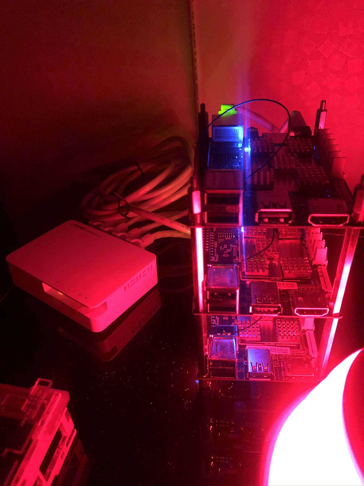
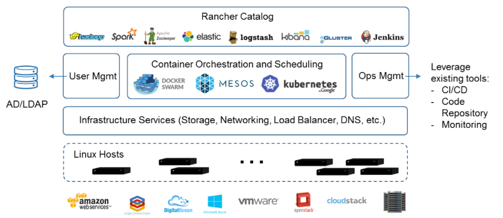
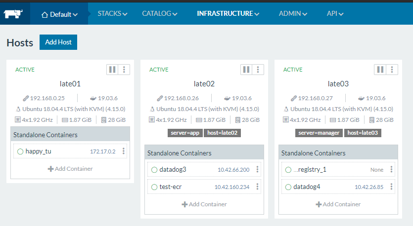
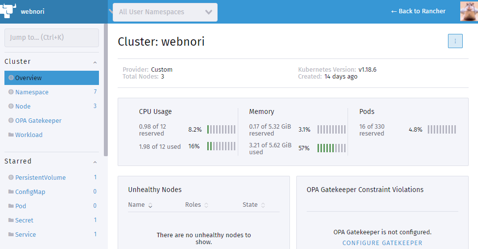

# 랜쳐를 이용한 홈 인프라구축

</img>

초소형 미니 PC 3대를 연결하여, 온프레미스 환경에서 서버 인프라를 구축해보자

클라우드를 사용하는 빠른시대에 이 구성을 선택한 이유는 단순하게 느린 취미활동과 

쿠버네티스를 학습을 위한 기본기를 연마를 하기 위해서 입니다.

또한 홈 인프라의 미니멀화와 심미성을 추구하고 있습니다.

# 인프라 목표

</img>

- 언젠가 로컬에서 개발환경을 모두 구축하는것을 포기하게 되었습니다. 도커가 있음에도 불구하구요,개발환경은 Local First가 되어야합니다.
- 여기서 시도된 컨셉은 AWS,쿠버네티스등 클라우드 환경으로 전환으로 시도되며 그와 관련된 CLI명령도 정리를 합니다.
- 인프라 셋팅및 CI/CD등, 코드가 인프라 자체를 설명하는 Code as InfraStruct 를 추구합니다.
- OpenStack(Elk,KAFKA,LogStash,Spark등)은 점점 더 강력해지고 활용성이 높아지고 있으며, 클라우드를 이용하더라도 기본기가 요구됩니다. 도커의 발달과 함께 이제 복합인프라 구축은 
- 주요 인프라요소인 LB 로드밸런스(Nginx/Haproxy)컨셉을 모르체, ELB만 사용할줄 아는것은 분명 인프라 구축에 한계가 올것이며 최종은 클라우드를 지향하지만,AWS FIRST 를 지양합니다.
- 랜쳐는 단지 다양한 인프라를 조합하여 오케스트라하는 툴이며,쿠버네티스를 포함시킬수도 있습니다.

DocList : 
- https://www.slexn.com/rancher/
- http://wiki.webnori.com/display/kubernetes/Kubernetes+For+Onpremise

# Rancher 1.6

https://github.com/webnori 멤버가 되면
SSO로 연동되어 Github계정으로 웹노리 제공 Rancher를 연습할수 있습니다. (가입조건없음)

- https://hub.webnori.com
    

# 웹노리 Rancher 1.6

</img>

# 웹노리 Rancher With Kube

</img>
